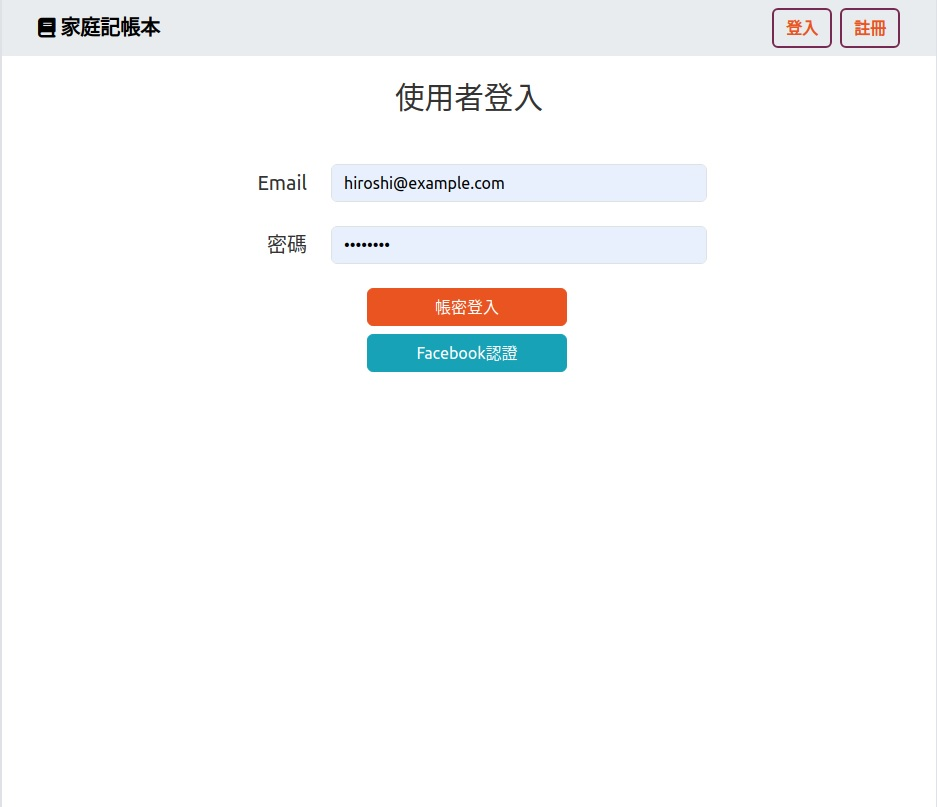
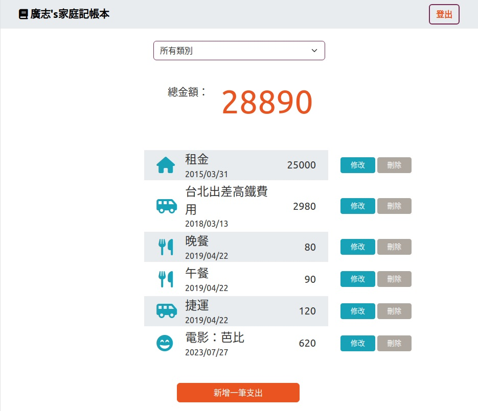
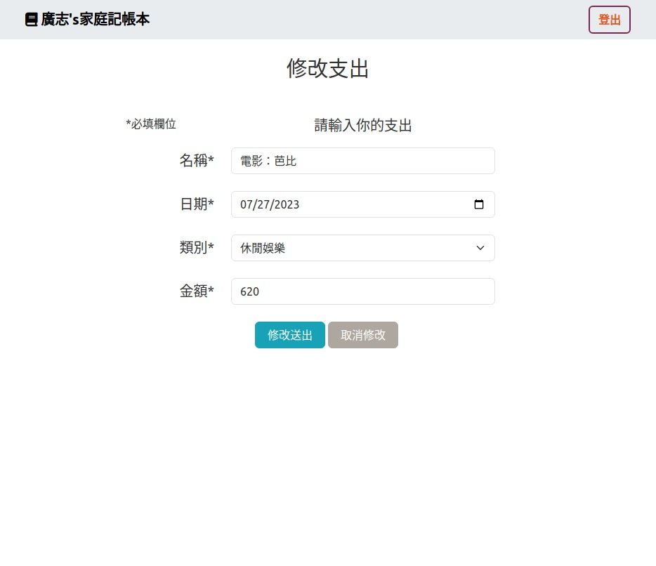

# ac-expense-tracker
一個網路記帳工具，提供個人化服務，可以新增、修改與刪除支出紀錄

## 功能說明

* 提供個人帳密註冊、登入、登出，並支援使用facebook認證登入
* 可以管理個人所有支出紀錄, 並有提供分類功能
* 可搜尋餐廳名稱
* 點選各餐廳卡片，可瀏覽餐廳詳細資料
* 可以新增支出
* 可以修改支出資料
* 可以刪除支出


## 安裝與執行

1. 請先確認安裝有node.js及npm
2. 開啟終端機，進入專案目錄，並從github下載資料

```
> git clone https://github.com/erikku54-AlphaCampExercise/ac-expense-tracker.git
```

3. 安裝套件

```
> cd ac-expense-tracker
> npm install
```

4. 設定環境變數: 在專案資料夾下的.env.example檔案名稱修改為.env，並填入你的MongoDB連線字串及FACEBOOK應用程式資料
```
MONGODB_URI = "<你的連線字串>"
FACEBOOK_ID = "<Facebook應用程式編號>"
FACEBOOK_SECRET = "<Facebook應用程式密鑰>"

```

5. 設定種子資料: 在終端機執行底下指令，匯入種子資料到資料庫裡
```
> npm run seed

```

6. 執行程式，啟動監聽

```
> npm run start
```

7. 啟動程式後，開啟瀏覽器並至 http://localhost:3000/users/login 開始瀏覽

## 畫面截圖







## 開發環境與套件

* VS Code - 編程環境
* node.js / express.js@4.18.2- 後端框架
* express-handlebars@7.1.0 - 樣板引擎
* bootstrap@5.2.3 - 樣式
* fontawesome@5.8.1 (CDN) - icon
* mongoose@7.4.0 - 連結MongoDB資料庫
* sweetalert2@11 (CDN) - 彈出視窗
* method-override@3.0.0 - 覆寫http方法
* bcryptjs@2.4.3 - 字串加密
* express-session@1.17.3 - 狀態管理機制
* passport@0.6.0 - 使用者認證
* passport-local@1.0.0 - 本地帳密認證策略
* passport-facebook@3.0.0 - facebook認證策略
* connect-flash@0.1.1 - flash訊息系統

底下為開發中使用
* dotenv@16.3.1 - 管理環境變數
* eslint@8.45.0 - 代碼風格

## 作者

* **Eric Huang** 